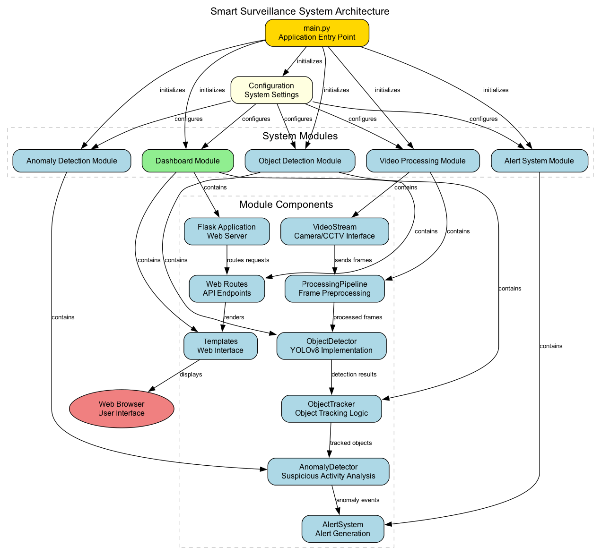
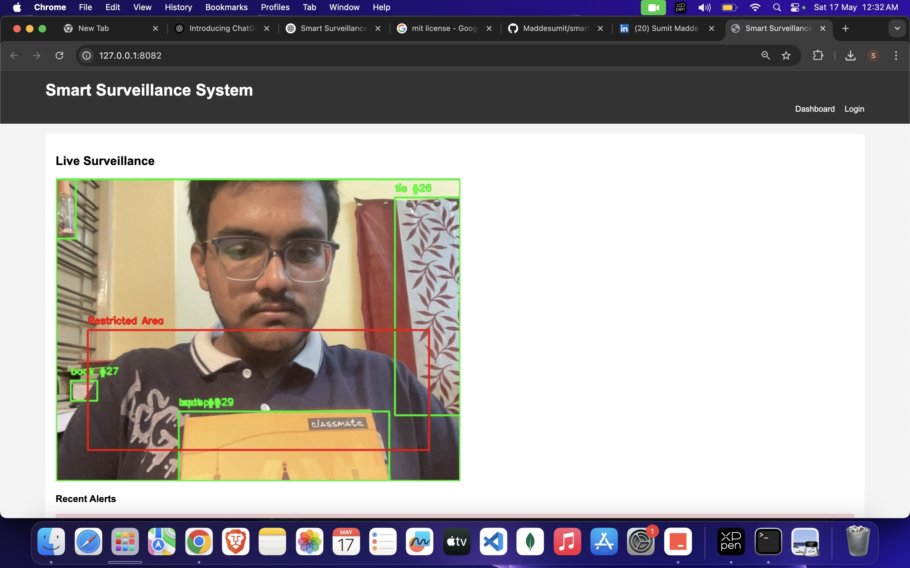
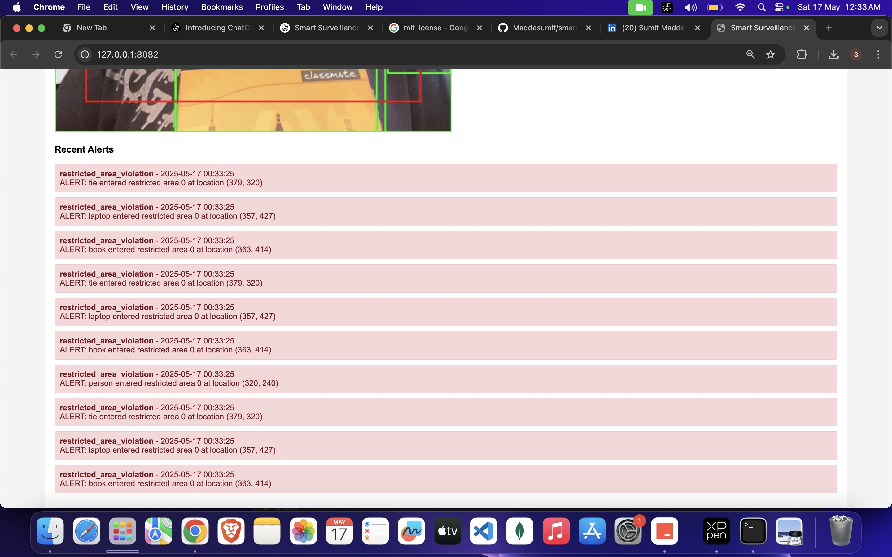
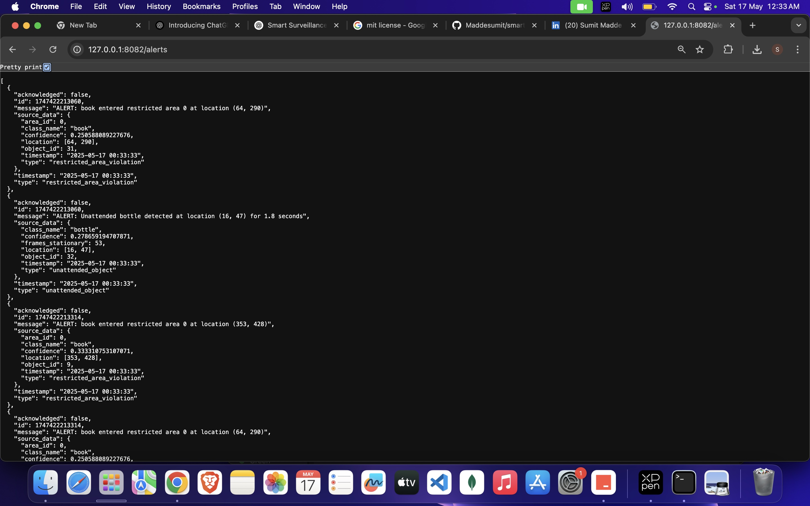

# 🧠 Smart Surveillance System

A real-time surveillance system leveraging computer vision and deep learning to detect and respond to suspicious activities.

---
## 🏗️ System Architecture



## 🚀 Features

- **🔴 Real-time Video Processing**  
  Supports webcam and CCTV streams with automatic fallback mechanisms.

- **🎯 Object Detection**  
  Uses **YOLOv5** for accurate detection of people and objects.

- **📍 Object Tracking**  
  Tracks objects across video frames using IoU and centroid distance.

- **⚠️ Anomaly Detection**  
  Detects various suspicious behaviors:
  - Unattended objects (e.g., bags, backpacks)
  - Restricted area violations
  - Stationary object detection

- **📬 Alert System**  
  Generates and logs alerts with customizable templates.

- **🌐 Web Dashboard**  
  Flask-based monitoring dashboard with live updates and alert status.

- **📝 Logging System**  
  Maintains logs of all system activity and alert history.

---

## 📸 System Screenshots

### Dashboard Overview
The Dashboard Overview screenshot showcases the main interface of the Smart Surveillance System. This central control panel provides real-time video feeds with object detection overlays, system status indicators, and quick access to all monitoring features. The intuitive layout allows security personnel to monitor multiple areas simultaneously while maintaining awareness of any detected anomalies.


### Alert Detection
The Alert Detection screenshot demonstrates the system's ability to identify and highlight suspicious activities in real-time. When potential security threats are detected—such as unattended objects, unauthorized access to restricted areas, or unusual movement patterns—the system immediately flags these events with visual indicators and generates detailed alerts. This screenshot shows how the system visually marks detected anomalies directly on the video feed for immediate operator attention.


### System Monitoring
The System Monitoring screenshot illustrates the comprehensive analytics and logging capabilities of the Smart Surveillance System. This view provides historical data on detected events, system performance metrics, and alert statistics. Security administrators can review past incidents, analyze detection patterns, and generate reports for security audits. The monitoring interface also displays system health information, ensuring all components are functioning optimally.


---

## 📁 Project Structure

```
smart_surviance/
├── config/                # Configuration settings
├── logs/                  # Application logs
├── src/
│   ├── alert_system/      # Alert generation and notification logic
│   ├── anomaly_detection/ # Anomaly detection algorithms
│   ├── dashboard/         # Web dashboard (Flask app)
│   ├── object_detection/  # Object detection and tracking logic
│   └── video_processing/  # Video capture and stream processing
├── .gitignore
├── main.py                # Main application entry point
├── requirements.txt       # Python dependencies
└── test_system.py         # Test script to validate system functionality
```

---

## ✅ Requirements

- Python 3.8+
- OpenCV
- NumPy
- Flask
- TensorFlow or PyTorch
- Webcam or CCTV stream

---

## 🛠 Installation

### 1. Clone the Repository

```bash
git clone https://github.com/yourusername/smart_surviance.git
cd smart_surviance
```

### 2. Create and Activate Virtual Environment

```bash
# Create virtual environment
python -m venv venv

# Activate (Linux/macOS)
source venv/bin/activate

# Activate (Windows)
venv\Scripts\activate
```

### 3. Install Dependencies

```bash
pip install -r requirements.txt
```

### 4. Download Detection Models (if not included)

Example for YOLOv5:

```bash
# Download a pre-trained model
mkdir models
wget https://github.com/ultralytics/yolov5/releases/download/v6.1/yolov5s.pt -P models/
```

---

## ⚙️ Configuration

Edit the file `config/settings.py` to set up your environment:

- ✅ Video source settings (webcam index or IP camera stream)
- ✅ Object detection parameters
- ✅ Twilio credentials (Account SID, Auth Token, Phone Numbers)
- ✅ Web dashboard port and display settings
- ✅ Alert thresholds and cooldown times

---

## ▶️ Running the System

### 1. Start the Application

```bash
python main.py
```

This will:
- Start the video stream
- Run object detection and tracking
- Perform anomaly detection
- Launch the web dashboard and logging system

### 2. Access the Dashboard

Open a browser and go to:

```
http://localhost:5000
```

### 3. Run Tests (Optional)

To ensure all modules work correctly:

```bash
python test_system.py
```

---

## 🧪 Development

- Add new algorithms → `src/anomaly_detection/`
- Extend alert types → `src/alert_system/`
- Customize dashboard → `src/dashboard/`


---

## 🛑 Stopping the System

Use `Ctrl + C` in the terminal to stop all services gracefully.

---

## 📄 License

MIT License. See LICENSE file for details.
